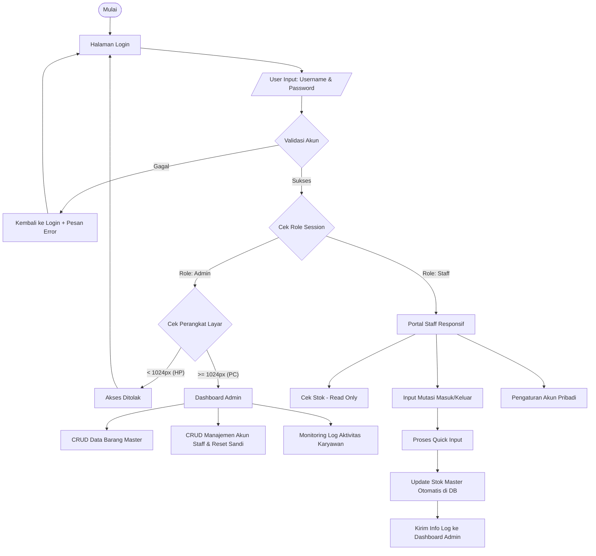

# 📦 Inventory v3.5 — PT Citra Buana Delapan

### 🏬 Sistem Manajemen Inventori Berbasis Web | Stationery & Daily Essentials
Sistem stok barang dengan kontrol akses berbasis peran (*role-based access*) untuk Admin Gudang dan Staff, dibangun dengan **Native PHP & MySQL**.


---

## 🧾 Tentang Proyek

**Inventory v3.5** adalah sistem manajemen stok yang dikembangkan khusus untuk **PT Citra Buana Delapan**, perusahaan yang bergerak di bidang *stationery* dan kebutuhan harian. Sistem ini dirancang untuk menggantikan pencatatan manual dengan alur kerja digital yang terstruktur, memisahkan akses antara **Admin Gudang** (kontrol penuh, khusus desktop) dan **Staff** (operasional harian, *responsive* di HP maupun laptop).

---

## 🎯 Fitur Utama

- 🔐 **Autentikasi Berbasis Peran:** Login terpisah untuk *Admin Gudang* dan *Pengguna (Staff)* dengan tab switching pada satu halaman.
- 🖥️ **Akses Adaptif per Perangkat:** Dashboard Admin hanya bisa diakses dari layar ≥ 1024px (PC/laptop); akses dari HP otomatis ditolak demi keamanan data master.
- 📊 **Dashboard Admin:** CRUD data barang master, manajemen akun staff & reset sandi, serta monitoring log aktivitas karyawan.
- 📱 **Portal Staff Responsif:** Cek stok (*read-only*), input mutasi barang masuk/keluar dengan *quick input*, dan update stok master otomatis ke database.
- ✍️ **Registrasi Akun (`daftar.php`):** Pendaftaran akun baru dengan alur persetujuan berbasis role.
- 🔑 **Lupa Sandi (`lupa_sandi.php`):** Reset password mandiri dengan UI split-panel yang konsisten dengan halaman login.

---

## 🖼️ Tampilan Aplikasi

<div align="center">
  
  <p><i>Halaman Login — Split Panel UI dengan pemilihan role Admin Gudang / Pengguna Staff</i></p>
</div>

---

## 🔄 Alur Sistem (System Flow)



> 💡 Diagram di atas otomatis ter-render di GitHub karena menggunakan format Mermaid.

---

## 🛠️ Tech Stack


---

## 📂 Struktur Proyek

```
inventory-v3.5/
├── login.php
├── daftar.php
├── lupa_sandi.php
├── admin/
│   ├── dashboard.php
│   ├── barang.php
│   ├── akun_staff.php
│   └── log_aktivitas.php
├── staff/
│   ├── dashboard.php
│   ├── cek_stok.php
│   ├── mutasi.php
│   └── pengaturan_akun.php
├── assets/
│   ├── css/shared.css
│   └── js/shared.js
├── config/
│   └── database.php
└── screenshots/
    └── login-page.png
```

---

## ⚙️ Instalasi & Setup

<details>
  <summary><b>📥 Cara Menjalankan Secara Lokal</b></summary>
  <br>

  1. Clone repository ini ke folder htdocs (XAMPP) atau folder server lokal Anda.
  2. Import database melalui phpMyAdmin (file `.sql` ada di folder `database/`).
  3. Sesuaikan kredensial koneksi database di `config/database.php`.
  4. Jalankan Apache & MySQL melalui XAMPP/Laragon.
  5. Akses `http://localhost/inventory-v3.5/login.php` di browser.

</details>

---

## 🚧 Roadmap

- [x] Halaman Login (Split Panel UI, role-based)
- [x] Halaman Registrasi (`daftar.php`)
- [x] Halaman Lupa Sandi (`lupa_sandi.php`)
- [ ] Dashboard Admin (CRUD Barang & Akun Staff)
- [ ] Portal Staff Responsif
- [ ] Modul Monitoring Log Aktivitas

---

## 👨‍💻 Developer

**Raza Ikhsan Al Fitrah**
Founder & CEO of [Azaadesigns ID](https://azaadesigns-id.vercel.app/) · Full-Stack Developer · Workflow Automation Engineer

- 📧 azzyycans@gmail.com
- 📸 [@raaa_zaaaa](https://www.instagram.com/raaa_zaaaa/)

---

<div align="center">
  <sub>© 2026 PT Citra Buana Delapan — Internal Use System</sub>
</div>
